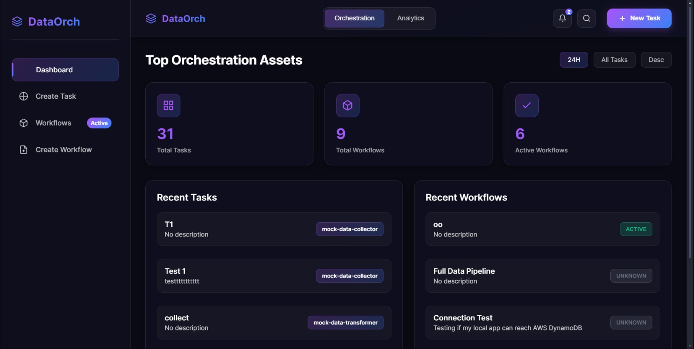
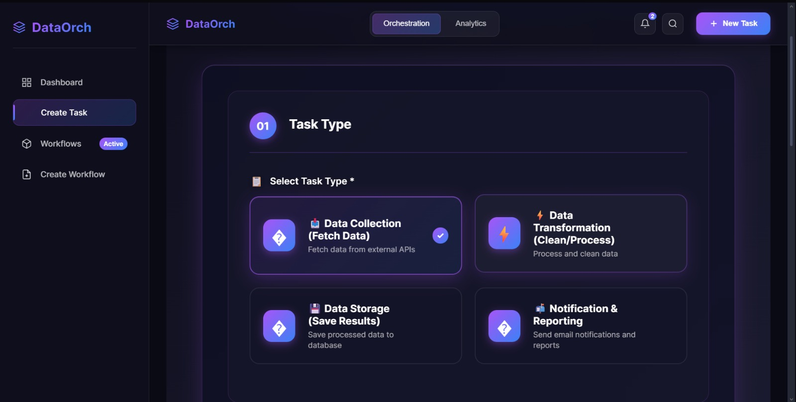
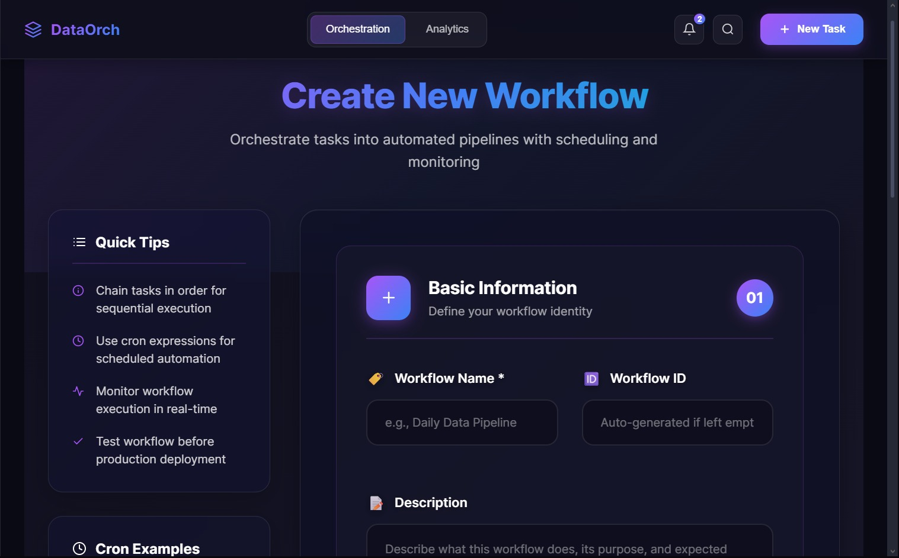
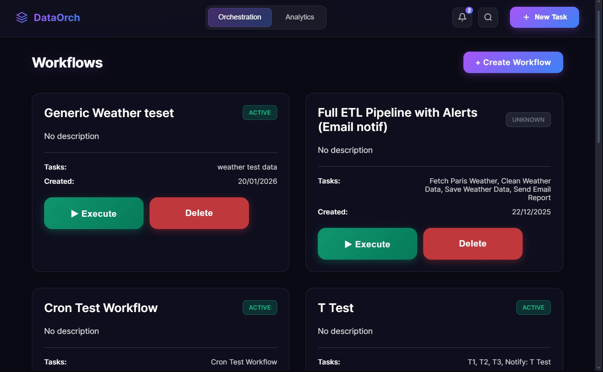

# 🚀 Quick Start Guide – Data Orchestration Platform

Complete step-by-step guide to run the project from scratch.

---

## 📸 Application Screenshots

Below are screenshots of the application running locally (Backend + Frontend).

### 🏠 Dashboard


### ➕ Create Task


### 🔁 Create Workflow


### 📋 Workflows List


### 📊 Backend Logs (Running Workflow)


> 📌 Screenshots are stored in the `screenshots/` folder at the root of the repository.

---

## 📋 Prerequisites Checklist

Before starting, ensure you have:

- ✅ **Java 21+**
```bash
java -version
```

- ✅ **Maven 3.6+**
```bash
mvn -version
```

- ✅ **Node.js 14+ and npm**
```bash
node -v
npm -v
```

- ✅ **AWS Account with:**
  - DynamoDB access
  - Lambda access
  - Valid AWS credentials

---

## 🔧 Step 1: AWS Setup

### 1.1 Configure AWS Credentials
⚠️ **Important:** Never commit real AWS credentials.

Create a local `application.properties` file:

```properties
spring.application.name=Cloud_Task_Orchestration_Platform

aws.accessKeyId=${AWS_ACCESS_KEY_ID}
aws.secretAccessKey=${AWS_SECRET_ACCESS_KEY}
aws.region=eu-north-1
```

🔒 Make sure this file is ignored in `.gitignore`.

### 1.2 Create DynamoDB Tables
Create the following tables in AWS DynamoDB:

| Table Name   | Partition Key     |
|--------------|-------------------|
| Tasks        | taskId (String)   |
| Workflows    | id (String)       |
| JobHistory   | jobId (String)    |

You can create them using AWS Console or AWS CLI.

---

## 🔴 Step 2: Start Backend (Spring Boot)

### 2.1 Navigate to Backend Directory
```bash
cd Cloud_Task_Orchestration_Platform
```

### 2.2 Build the Project
```bash
mvn clean install
```

Expected output:
```bash
BUILD SUCCESS
```

### 2.3 Run the Backend
```bash
mvn spring-boot:run
```

Backend will run at:
```arduino
http://localhost:8080
```

✅ **Test backend:**
- http://localhost:8080/api/tasks
- http://localhost:8080/api/workflows

---

## 🟢 Step 3: Start Frontend (React)

### 3.1 Open a New Terminal Window

### 3.2 Navigate to Frontend Directory
```bash
cd frontend
```

### 3.3 Install Dependencies (First Time Only)
```bash
npm install
```

### 3.4 Run the Frontend
```bash
npm start
```

Frontend will run at:
```arduino
http://localhost:3000
```

---

## 🎯 Step 4: Verify Everything Works

### Backend Verification
- APIs return HTTP 200
- No errors in backend logs

### Frontend Verification
- Dashboard loads correctly
- Tasks and workflows can be created
- Network tab shows successful API calls

---

## 📂 Project Structure

```bash
Data-Orchestration-platform/
├── Cloud_Task_Orchestration_Platform/   # Backend (Spring Boot)
│   ├── src/main/java/
│   │   ├── config/
│   │   ├── controller/
│   │   ├── model/
│   │   ├── repository/
│   │   └── service/
│   └── src/main/resources/
│       └── application.properties (ignored)
│
├── frontend/                            # Frontend (React)
│   ├── src/
│   ├── package.json
│
└── screenshots/                         # App screenshots
```

---

## 🚀 Production Deployment

### Backend
```bash
mvn clean package
java -jar target/cloud-task-orchestration-platform-0.0.1-SNAPSHOT.jar
```

### Frontend
```bash
npm run build
```
Deploy the `build/` folder to your web server.

---

## 🛠️ Troubleshooting

### Backend Issues
- **Port 8080 in use** → Kill process or change port
- **AWS credentials error** → Check environment variables
- **DynamoDB table not found** → Create tables first

### Frontend Issues
- **Port 3000 in use** → Stop running process
- **API not reachable** → Ensure backend is running
- **CORS errors** → Check backend CORS configuration

---

## ✅ Final Checklist

- [ ] Java installed
- [ ] Maven installed
- [ ] Node.js installed
- [ ] AWS credentials configured
- [ ] DynamoDB tables created
- [ ] Backend running on port 8080
- [ ] Frontend running on port 3000
- [ ] Tasks created successfully
- [ ] Workflows executed successfully